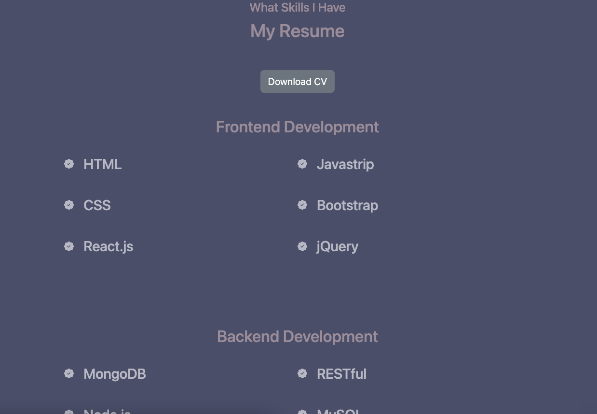

# Portfolio

### License

---

## Description

A web personal portfolio create by React.js

---

## Table of Contents

1. [Installation](#installation)
2. [Usage](#usage)
3. [Test](#test)
4. [Questions](#questions)

---

## Installation Instructions

The user should clone the repository from GitHub and download Node.js. This application also requires to npm install node_modules, package-lock.json, and npm run build

---

## Usage Information

- Please open the link below and click. 
 [Deploy](https://tottomoe.github.io/ReactPortfolio/)

---

## Test ScreenShot

## Questions

### GitHub Profile:

https://github.com/TottoMoe

### Contact Me:

If you have any additional questions, please send me an email.

#### jennydhj@gmail.com

---
